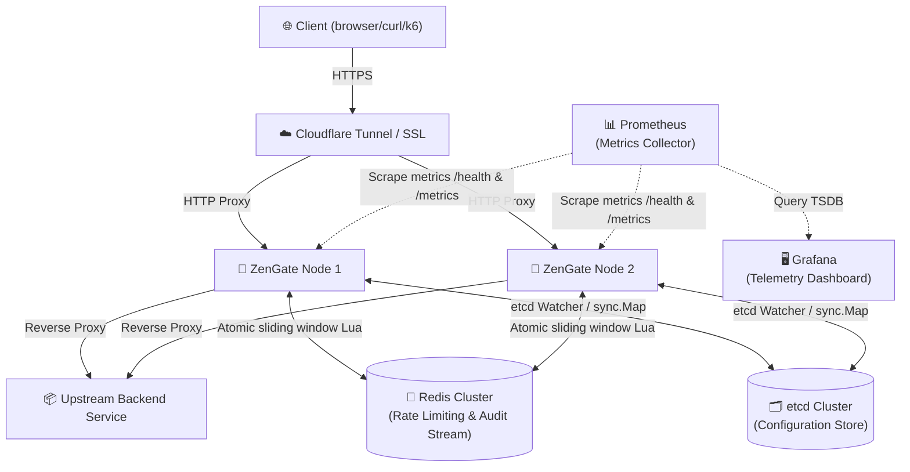
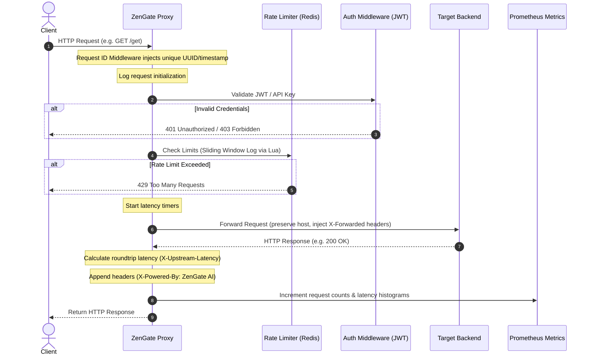
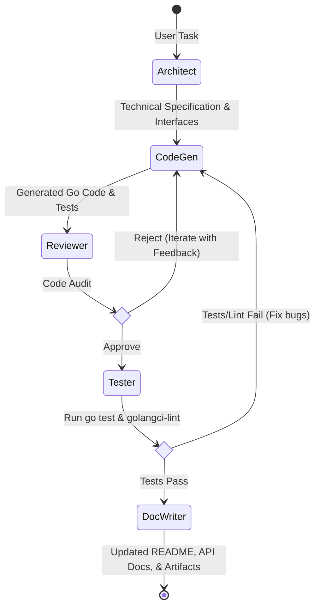

# ZenGate AI — System Architecture & Design Specification

This document provides a detailed technical specification of the ZenGate AI Distributed API Gateway, detailing system layout, data flow pipelines, configurations, and multi-agent development architecture.

---

## 🏗️ 1. System Topology Overview

ZenGate AI is structured as a stateless gateway proxy layer that coordinates with distributed state stores (Redis, etcd) to enforce access policies, perform real-time rate limiting, collect telemetry, and support runtime configuration hot reloading.

---

## 🔀 2. Request Lifecycle & Data Flow

When an HTTP request hits a ZenGate node, it flows through a middleware pipeline before reaching the reverse proxy handler.

---

## ⚙️ 3. Dynamic Configuration & Hot Reload

ZenGate AI leverages etcd to enable distributed policy configuration without gateway restarts. The control plane writes rules to etcd, and gateway nodes reload policies instantly via watchers.

```mermaid
flowchart LR
    Admin["👤 Admin / CLI"]
    NLPolicy["💬 NL Input: 'rate limit 5k/min'"]
    Agent["🧠 Config Translator Agent"]
    CP["🛡️ Control Plane API"]
    Etcd[("🗂️ etcd Cluster")]
    GW["🚀 ZenGate Nodes (Watcher)"]
    Cache["💾 In-memory sync.Map"]

    Admin --> NLPolicy
    NLPolicy --> Agent
    Agent -->|Structured JSON Policy| CP
    CP -->|PUT /keys/policies| Etcd
    Etcd -->|gRPC Watch Stream Event| GW
    GW -->|Decode & Atomic Update| Cache
```

### Hot Reload Details:
1. **Startup:** Each ZenGate node loads configuration policies from etcd and populates a thread-safe `sync.Map`.
2. **Subscription:** Nodes spawn a background goroutine hosting an `etcdv3` watch client targeting the `/policies/` key prefix.
3. **Trigger:** When etcd pushes a modify/create/delete event, the watch client intercepts it, decodes the payload, and performs an atomic swap on the local `sync.Map` store.
4. **Performance:** Request routing lookups query the `sync.Map` cache directly. This guarantees `<1µs` local lookup overhead while executing live hot updates within `<500ms` cluster-wide propagation.

---

## 🧠 4. ADK Development Multi-Agent Pipeline

To automate coding, testing, and documentation tasks, ZenGate integrates a Python multi-agent pipeline scaffolded using Google ADK.

### Agent Roles & Workspaces:
- **Orchestrator:** Manages execution flow, retry limits, and shared file state memory (`.zengate-adk-memory`).
- **Architect:** Designs interface structures and creates interface contracts.
- **CodeGen:** Generates Go code, handlers, middleware, and unit tests.
- **Reviewer:** Checks correctness, safety, concurrency bugs, and race conditions.
- **Tester:** Invokes linting checklists and runs `go test -race -cover`.
- **DocWriter:** Automatically drafts API specs, diagrams, and README references.
