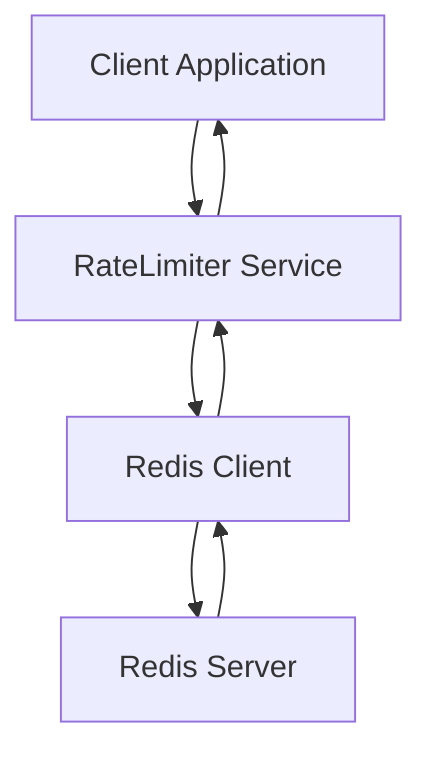
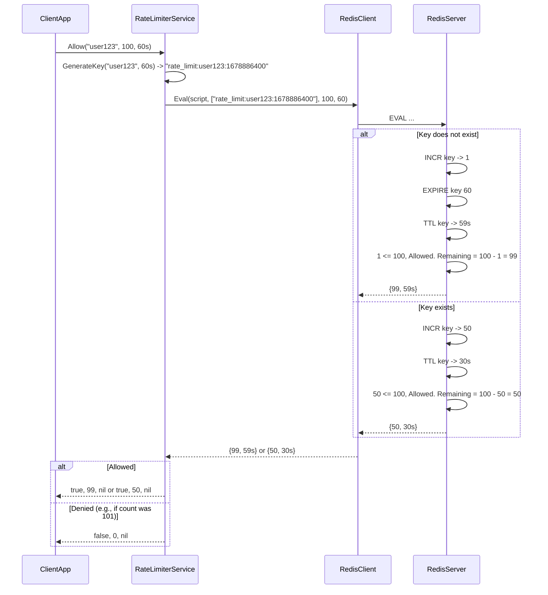

# Redis Rate Limiter - System Architecture

## Overview

This document outlines the architecture for a Redis-based rate limiter. The goal is to provide a robust and scalable mechanism for controlling the rate at which certain actions can be performed, leveraging Redis for its speed and atomic operations.

The rate limiter will support different strategies, starting with a simple fixed-window counter and potentially expanding to other algorithms like sliding window or token bucket. For this initial design, we will focus on the fixed-window counter.

The system will consist of the following core components:

1.  **RateLimiter Service:** The primary interface for clients to interact with the rate limiter. It will accept requests to check or consume a certain number of "tokens" for a given resource and identifier.
2.  **Redis Client:** A component responsible for communicating with the Redis server, executing commands, and handling responses.
3.  **Rate Limiting Logic:** The core logic that determines if a request should be allowed or denied based on the configured limits and the current state stored in Redis.

## Interface Contracts (Go Interfaces)

```go
// RateLimiter defines the interface for rate limiting operations.
type RateLimiter interface {
	// Allow checks if a request is allowed for a given identifier within a specified limit.
	// It returns true if allowed, false otherwise. It also returns the remaining
	// number of allowed requests and an error if any occurred.
	Allow(identifier string, limit uint64, window time.Duration) (bool, uint64, error)

	// Consume attempts to consume a specified number of tokens for a given identifier.
	// It returns true if the consumption was successful (i.e., within limits),
	// false otherwise. It also returns the remaining tokens and an error if any occurred.
	// This method is a more general form of Allow, allowing for consuming > 1 token.
	Consume(identifier string, count uint64, limit uint64, window time.Duration) (bool, uint64, error)
}

// RedisClient defines the interface for interacting with Redis.
// This allows for easy mocking and swapping of Redis implementations.
type RedisClient interface {
	// Incr increments the integer value of a key by one.
	// Returns the new value of the key after the increment.
	Incr(key string) (int64, error)

	// TTL returns the time to live of a key.
	// Returns -2 if the key does not exist.
	// Returns -1 if the key exists but has no associated expire.
	TTL(key string) (time.Duration, error)

	// SetNX sets the value of a key only if the key does not already exist.
	// Returns true if the key was set, false if the key already existed.
	SetNX(key string, value interface{}, expiration time.Duration) (bool, error)

	// Eval executes a Lua script server-side.
	// It takes a script, keys, and arguments.
	Eval(script string, keys []string, args ...interface{}) (interface{}, error)

	// Close closes the Redis client connection.
	Close() error
}
```

## Data Flow

The primary data flow for a single `Allow` request using the fixed-window counter strategy is as follows:

1.  **Client Request:** A client application calls the `Allow` method on the `RateLimiter` service, providing an `identifier` (e.g., user ID, IP address, API endpoint), the `limit` (max requests per window), and the `window` duration.
2.  **Key Generation:** The `RateLimiter` service constructs a Redis key. For a fixed-window counter, this key typically includes the `identifier` and a timestamp representing the start of the current window. A common approach is to use `fmt.Sprintf("%s:%d", identifier, time.Now().Unix() / int64(window.Seconds()))`. This ensures that each window gets a unique key.
3.  **Redis `INCR` and `TTL` (or `EVAL`):**
    *   **Initial Request within Window:** If the key does not exist in Redis, the `INCR` command will return `1`. The `RateLimiter` service then needs to set an expiration on this key using `TTL` (or more efficiently, it could be combined with `INCR` if the Redis client supports `INCR` with expiration, or using a Lua script). The expiration should be set to the `window` duration.
    *   **Subsequent Requests within Window:** If the key already exists, `INCR` will return the current count. The `TTL` will be checked to see how much time is left in the window.
    *   **Using Lua Script (Recommended):** A single Lua script can atomically perform the increment, check the count, set the expiration if it's the first request, and return the current count and remaining TTL. This is highly recommended to avoid race conditions.
        *   The script would look something like this:
            ```lua
            local key = KEYS[1]
            local limit = tonumber(ARGV[1])
            local window_seconds = tonumber(ARGV[2])

            local current_count = redis.call('INCR', key)

            if current_count == 1 then
                redis.call('EXPIRE', key, window_seconds)
            end

            local ttl = redis.call('TTL', key)

            if current_count > limit then
                return {0, ttl} -- Deny, return 0 remaining
            else
                return {limit - current_count, ttl} -- Allow, return remaining
            end
            ```
4.  **Decision Logic:** The `RateLimiter` service receives the current count and remaining TTL from Redis.
    *   If the current count (after increment) is less than or equal to the `limit`, the request is allowed. The service returns `true` and the number of remaining requests (`limit - current_count`).
    *   If the current count exceeds the `limit`, the request is denied. The service returns `false` and `0` remaining requests.
5.  **Response:** The `RateLimiter` service returns the decision (`bool`), remaining requests (`uint64`), and any potential `error` to the client application.

**Data Flow Diagram (Conceptual):**



**Detailed Flow with Fixed Window Counter & Lua Script:**



## Design Decisions & Trade-offs

1.  **Fixed-Window Counter vs. Sliding Window/Token Bucket:**
    *   **Decision:** Start with a fixed-window counter for simplicity and performance.
    *   **Trade-off:** Fixed-window counters can have "bursty" traffic issues at the window boundary (e.g., if a limit of 100 requests/minute is reached at 00:00:59, the same user can make another 100 requests at 00:01:00).
    *   **Future:** Consider implementing sliding window log or sliding window counter for more accurate rate limiting, at the cost of increased Redis memory usage and complexity. Token bucket is another viable option.

2.  **Redis Data Structures:**
    *   **Decision:** Use Redis `STRING` types with `INCR`, `EXPIRE`/`TTL`, and potentially `SETNX`. A Lua script will orchestrate these operations.
    *   **Trade-off:** `STRING` types with `INCR` are highly efficient for counting. The fixed-window approach is simple. Storing granular time-series data (like in a sliding window log) would consume significantly more memory.

3.  **Atomicity and Race Conditions:**
    *   **Decision:** Utilize Redis Lua scripting to ensure atomic execution of `INCR`, `EXPIRE`, and read operations. This is critical to prevent race conditions where multiple clients might read the count before an expiration is set or update the count incorrectly.
    *   **Trade-off:** Lua scripts add a dependency on Redis's Lua interpreter and require careful script writing. However, the performance and correctness gains outweigh this.

4.  **Key Naming Convention:**
    *   **Decision:** Use a structured key format like `rate_limiter:<identifier>:<window_start_timestamp>`. The window start timestamp can be calculated by `time.Now().Unix() / int64(window.Seconds())`.
    *   **Trade-off:** This ensures that each window has its own counter. The timestamp division automatically groups requests into the correct window.

5.  **Error Handling:**
    *   **Decision:** Return errors from the `RateLimiter` interface for Redis connectivity issues or unexpected Redis responses. The `Allow` and `Consume` methods should return `false` and `0` remaining tokens when an error occurs, or the decision should be based on a default safe-mode (e.g., deny all requests if the rate limiter is unavailable). For now, returning the error is preferred for observability.
    *   **Trade-off:** Clients must be prepared to handle potential errors from the rate limiter.

6.  **Client Implementation:**
    *   **Decision:** The `RedisClient` interface abstracts the actual Redis driver (e.g., `go-redis`). This allows for easy testing with mocks and future migration to different Redis clients.
    *   **Trade-off:** Adds a layer of abstraction.

7.  **Configuration:**
    *   **Decision:** Limits and windows will be passed as parameters to the `Allow`/`Consume` methods.
    *   **Trade-off:** Dynamic configuration (e.g., fetching limits from a config service) is not included in this initial design but could be added later by having the `RateLimiter` service query a configuration source.

## Dependencies

*   **Redis:** A running Redis instance is required.
*   **Go Redis Client Library:** A library like `github.com/go-redis/redis/v8` (or v9) to interact with Redis. This would be abstracted behind the `RedisClient` interface.
*   **Standard Go Libraries:** `time`, `fmt`, etc.