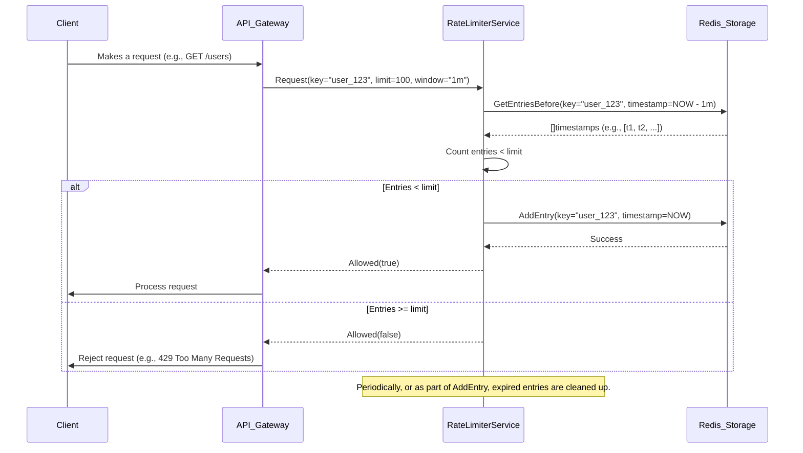

Okay, I will build the Redis rate limiter.

## Redis Rate Limiter: System Architecture

### Overview

This document outlines the system architecture for a Redis-based rate limiter. The primary goal is to protect backend services from being overwhelmed by excessive requests by limiting the number of requests a client can make within a specified time window. Redis is chosen for its speed, atomic operations, and distributed nature, making it suitable for high-throughput rate limiting.

The rate limiter will expose a simple interface that other services can use to check if a request is allowed. It will support various rate limiting strategies, with a sliding window log approach being the initial implementation.

### Interface Contracts (Go Interfaces)

```go
package ratelimiter

// RateLimiter defines the interface for a rate limiting service.
type RateLimiter interface {
	// Allow checks if a request is permitted for a given key within a time window.
	// It returns true if the request is allowed, false otherwise.
	// The key uniquely identifies the entity being rate-limited (e.g., user ID, IP address).
	// The limit is the maximum number of requests allowed.
	// The window is the duration of the time window.
	Allow(key string, limit int, window time.Duration) (bool, error)

	// Close releases any underlying resources held by the rate limiter.
	Close() error
}

// Storage defines the interface for the underlying storage used by the rate limiter.
// This allows for different storage backends to be used if needed.
type Storage interface {
	// AddEntry records an event (e.g., a request) associated with a key at a specific timestamp.
	// It should also handle the removal of expired entries.
	AddEntry(key string, timestamp time.Time) error

	// GetEntriesBefore retrieves all entries for a given key that occurred before a specific timestamp.
	GetEntriesBefore(key string, timestamp time.Time) ([]time.Time, error)

	// DeleteEntries deletes entries for a given key before a specific timestamp.
	DeleteEntries(key string, timestamp time.Time) error

	// Close releases any underlying resources held by the storage.
	Close() error
}
```

### Data Flow

The following diagram illustrates the data flow for a single request being rate-limited.



### Design Decisions & Trade-offs

1.  **Storage Backend:**
    *   **Decision:** Redis with a sorted set (ZSET) or a list (LIST) is chosen for `Storage`. A sorted set is preferred for its efficient `ZREMRANGEBYSCORE` for cleanup and `ZCOUNT` for counting within a range. A list with manual cleanup can also work.
    *   **Trade-off:** Redis is a single point of failure if not clustered. Network latency to Redis can impact rate limiter performance. However, its speed and atomic operations are crucial. Other options like in-memory maps would not be scalable or persistent.

2.  **Rate Limiting Algorithm:**
    *   **Decision:** Sliding Window Log is the initial implementation. Each request's timestamp is stored. When checking, we count the number of timestamps within the sliding window.
    *   **Trade-off:** This provides accurate rate limiting but can consume more memory/storage than fixed window or token bucket algorithms. Fixed window can lead to bursts at window boundaries. Token bucket requires careful configuration of refill rates and bucket size. Sliding window log is generally a good balance for accuracy and implementation complexity.

3.  **Key Generation:**
    *   **Decision:** Keys will be generated by concatenating relevant identifiers. For example, `rate_limiter:ip:<client_ip_address>` or `rate_limiter:user:<user_id>`.
    *   **Trade-off:** The granularity of the key determines what is being rate-limited. A more granular key offers finer control but can lead to a larger number of keys in Redis.

4.  **Cleanup Strategy:**
    *   **Decision:** Expired entries (timestamps outside the window) will be removed either:
        *   **Proactively:** During each `Allow` call, before counting. Redis's `ZREMRANGEBYSCORE` for sorted sets is efficient.
        *   **Reactively:** A background process periodically cleans up old entries.
    *   **Trade-off:** Proactive cleanup adds latency to each `Allow` call but ensures Redis doesn't grow indefinitely. Reactive cleanup requires a separate process and might lead to temporary memory bloat if cleanup is delayed. For high throughput, proactive cleanup with efficient Redis commands is generally preferred.

5.  **Distributed Systems Considerations:**
    *   **Decision:** Leveraging Redis's atomic operations (e.g., `ZADD`, `ZCOUNT`, `ZREMRANGEBYSCORE` or `LPUSH`, `LTRIM` in a loop) is critical. No external locking mechanisms are needed for the core Redis operations.
    *   **Trade-off:** Redis itself needs to be highly available (e.g., using Sentinel or Cluster) for the rate limiter to be reliable.

6.  **Error Handling:**
    *   **Decision:** The `Allow` method returns an `error`. This allows clients to distinguish between a rate limit rejection (which should return `false`) and a failure to check the rate limit (e.g., Redis connection error).
    *   **Trade-off:** Clients need to handle these errors appropriately, potentially falling back to a default behavior or retrying.

### Dependencies

*   **Redis:** A running Redis instance or cluster.
*   **Go `redis/go-redis` library:** For interacting with Redis from the Go implementation.
*   **`time` package:** For handling durations and timestamps.

This architecture provides a robust and scalable foundation for a Redis-based rate limiter. The use of Go interfaces allows for flexibility in implementation and potential future enhancements.