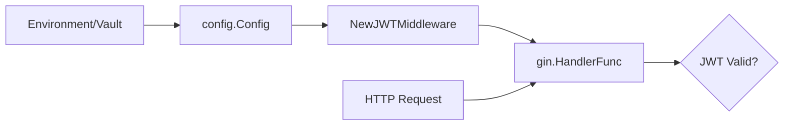

# Technical Specification: JWT Middleware Configuration Refactor

## Overview
The goal of this change is to refactor the `NewJWTMiddleware` constructor to utilize the centralized application configuration object (`*config.Config`) rather than accepting a raw secret string. This aligns the authentication layer with the project's dependency injection pattern, ensuring that secret management is handled consistently via the configuration provider.

## Interface Contracts

### Component: `internal/auth/middleware.go`

The constructor signature will be updated to transition from a primitive string dependency to a configuration object dependency.

**Current Signature (Implicit):**
```go
func NewJWTMiddleware(secret string) gin.HandlerFunc { 
    // ... 
}
```

**Updated Signature:**
```go
import "github.com/zengate-ai/zengate/internal/config"

// NewJWTMiddleware initializes the JWT validation middleware using the global app config.
func NewJWTMiddleware(cfg *config.Config) gin.HandlerFunc {
    secret := cfg.JWTSecret
    // implementation logic remains the same, using 'secret'
}
```

### Component: `internal/auth/middleware_test.go`

The test suite must be updated to instantiate a mock configuration object to satisfy the new constructor requirement.

**Test Setup Change:**
```go
func TestJWTMiddleware(t *testing.T) {
    mockCfg := &config.Config{
        JWTSecret: "test-secret-key",
    }
    middleware := NewJWTMiddleware(mockCfg)
    // ... test assertions
}
```

## Data Flow

1. **Initialization Phase**: 
   - `main.go` loads the environment variables into a `config.Config` struct.
   - The `config.Config` pointer is passed into the `NewJWTMiddleware` factory function.
2. **Extraction Phase**: 
   - `NewJWTMiddleware` accesses the `JWTSecret` field from the config object.
3. **Execution Phase**: 
   - The middleware closure captures the secret and uses it to validate incoming Bearer tokens in the HTTP request header.



## Design Decisions & Trade-offs

### Decision: Passing `*config.Config` vs. Specific Secret String
- **Decision**: Pass the entire config object.
- **Reasoning**: While passing only the string is "purest" from a decoupling perspective, passing the config object is the established pattern within the ZenGate AI codebase. It simplifies the initialization chain in `main.go` and allows the middleware to easily access other configuration parameters (e.g., token expiration or issuer) in future iterations without changing the function signature again.
- **Trade-off**: The middleware now has a dependency on the `config` package. This is an acceptable trade-off for consistency across the internal architecture.

### Decision: Mocking Config in Tests
- **Decision**: Use a literal struct initialization for `config.Config` in tests.
- **Reasoning**: Since `config.Config` is a simple Data Transfer Object (DTO) containing basic types, a mock object is sufficient and avoids the overhead of complex mocking frameworks.

## Dependencies

| Dependency | Version/Path | Purpose |
| :--- | :--- | :--- |
| `github.com/zengate-ai/zengate/internal/config` | Internal | Provides the `Config` struct and `JWTSecret` field. |
| `github.com/gin-gonic/gin` | External | Web framework for the middleware handler. |